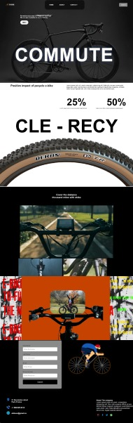
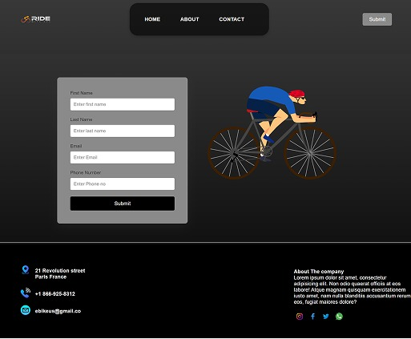
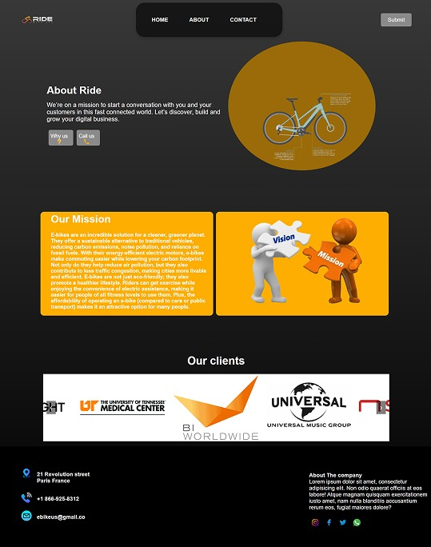

# eBike USA - Web-Based Project

Welcome to the **eBike USA** website! This project showcases an interactive and visually stunning platform for eBike enthusiasts in the United States. The website highlights the latest in electric bicycle technology, offers an intuitive interface for users to explore various eBike models, and provides a seamless browsing experience.

## Demo






## Features

- **Stunning Animations**: Smooth animations throughout the site using CSS and JavaScript, making the browsing experience dynamic and engaging.
- **Responsive Design**: Optimized for mobile, tablet, and desktop devices.
- **Interactive Gallery**: An interactive photo gallery showcasing the latest eBikes with a zoom feature.
- **Product Pages**: Detailed descriptions, pricing, and features for various eBike models.
- **Contact Form**: An easy-to-use contact form for customers to get in touch.

## Technologies Used

- **HTML5** - Structure and layout of the website.
- **CSS3** - Styling and animations.
- **JavaScript** - Interactive functionality (including animations and dynamic content).
- **Responsive Design** - Optimized for different screen sizes.
- **CSS Animations** - For smooth and dynamic transitions throughout the site.
- **JavaScript Libraries**: 
  - [GSAP](https://greensock.com/gsap/) for advanced animations.
  - [jQuery](https://jquery.com/) for DOM manipulation (if used).

## Getting Started

To get started with this project locally, follow these steps:

### Prerequisites

Make sure you have a modern web browser installed (e.g., Google Chrome, Firefox, Safari).

### Installation

1. Clone the repository to your local machine:
   ```bash
   git clone https://github.com/TalhaMasood23/bicycyle-private
